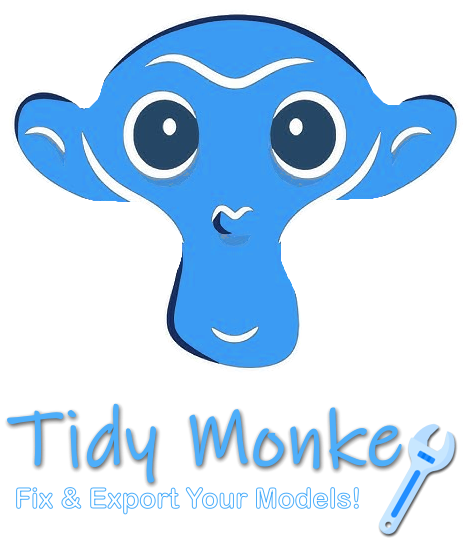
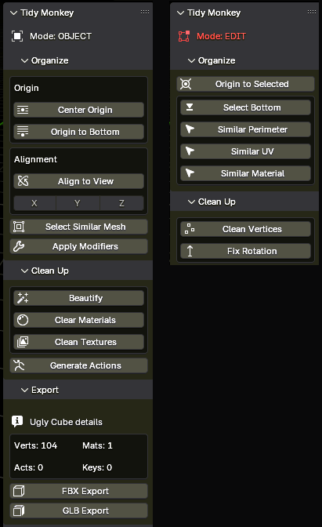

[//]: # (Constants)
[license-link]: ../../blob/main/LICENSE
[stars-link]: ../../stargazers
[vid-link]: https://www.youtube.com/shorts/CCbY_ETwFss
[website-link]: https://spark-games.co.uk
[coffee-link]: https://buymeacoffee.com/spark88
[bug-link]: ../../issues
[release-link]: ../../releases
[object-tutorial-link]: https://youtu.be/3g1JKg0-Wtc
[fork-link]: ../../fork
[privacy-link]: ../../blob/main/PRIVACY.md
[issues-link]: ../../issues

  

  <h3>Productivity Tools for Blender 3D Artists</h3>

  [][coffee-link] 
  [][issues-link]
  [][license-link]

## 📥 Installation
1. [Download latest release](../../releases)
2. Drag the `TidyMonkey.zip` file into Blender
3. Press `N` key to view the sidebar panel

## 🚀 Quick Start
Watch this [quick tutorial video][vid-link] 

  

## ✨ Features
- Topology cleanup and editing tools
- Automated mesh decimation and simplification
- Parent-child normal transfers
- Export automation with texture packing
- Material and texture management

### 📦 Object Mode
- **Beautify**: Applies consistent normals, transforms tris to quads, adds bevel/weighted normal modifiers, and transfers normals data between parent-child objects.
- **Clear Materials**: Removes all unused material from selected objects.
- **Clean Textures**: Removes all unused image textures from the .blend file.
- **Generate Actions**: Converts animation strips to individual action data blocks.
- **Rename Bones**: Removes keywords like `mixamo` from bone names without breaking the animation.
- **Export FBX/GLB**: Packs materials, textures and generates actions. Currently only supports FBX & GLB formats.

### ✏️ Edit Mode
- **Checker Edge**: Selects alternating edges in connected loops with dissolve option for topology decimation.
- **Clean Verts**: Identifies and dissolves vertices with exactly 2 edge connections.
- **Fix Rotation**: Aligns selected elements' rotation to world or local coordinate space.

<table>
<tr>
<td width="50%" valign="top">

<!--  -->

</td>
</tr>
</table>

## 🌱 Support & Contributions
Star the repo ⭐ & I power up like Mario 🍄 
Devs run on [coffee][coffee-link] ☕ 
[contributions][fork-link] are welcome.

---

Released under MIT License | <a href="[privacy-link]">Privacy Policy</a>

